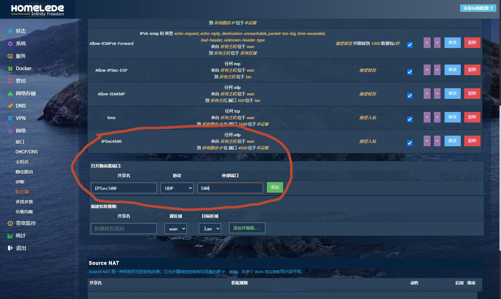

通过互联网快速接入家庭网络，实现文件存取，远程控制，是家庭网络日常使用中的典型场景。HomeLede推荐使用IPSec VPN来实现远程接入。不同于OpenVPN、PPTP，softethervpn、ZeroTier等方案，IPSec VPN 被目前主流操作系统原生支持，也就是说在IOS、Android、Windows、Mac OS上，均可以直接接入，而不需要额外安装软件，极大地简化了接入家庭网络的过程。

本方案实施前提：

- 具有公网IP地址（支持IOS、Android、MacOS接入）
- 具有公网IP地址，具备域名（通常是DDNS），具备证书。（支持Windows接入）

OpenWrt原生的IPSecVPN应用只支持IOS、Android设备接入，并不支持Windows10接入，HomeLede为此对现有应用进行了增强，于HomeLede v2020.06.20 上线了两款应用：

1. IPSec VPN 服务器增强版。修改自Lienol的IPSec VPN Server多用户版。增强了如下功能：
   - 支持IKEv2协议与Mschapv2认证，装备证书后实现Windows10接入。
   - 支持自定义VPN客户端IP地址
   - 支持自定义VPN客户端DNS
   - 支持VPN客户端直接使用家庭网络IP（直接使用家庭网络DHCP）
   
2. IPSec VPN 服务器Docker版。HomeLede原创，功能与第一款类似，不过VPN Server运行在Docker中。

   - 支持IKEv2协议与Mschapv2认证，装备证书后实现Windows10接入。

   - 支持自定义VPN客户端IP地址

   - 支持自定义VPN客户端DNS

     不支持使用家庭网络IP（此模式下无意义）

看到这里，相信大家会有疑惑，类似的功能，为什么要制作两款应用？

如果您的需求仅仅是接入家庭网络，访问家庭内网的NAS、服务器、打印机，控制家庭设备等等，两款应用完全胜任。如果您仅仅是刚才这些需求，直接使用——IPSec VPN 服务器增强版——即可。

但还有不少用户除了上面需求之外，还希望通过接入家庭网络，使用家庭网络中各种分流软件（PSW、Clash）等访问互联网。经测试，分流软件并不能很好的处理来自VPN客户端的访问流量，很大概率会造成路由器内核崩溃导致重启。因此如果您除了接入家庭之外，还想利用家庭网络的分流软件访问互联网，则需要使用——IPSec VPN 服务器Docker版。

HomeLede v2020.06.20版本内置了两款VPN应用。默认情况下，IPSec VPN 服务器Docker版 处于隐藏状态，如果您想使用Docker版本，请在登录路由管理界面后，在浏览器中输入`http://192.168.1.1/cgi-bin/luci/admin/vpn/strongswanInDocker/show`，则Docker版本就会显示到菜单中（连接中HomeLede路由器的地址，请根据你实际情况调整）。如下：

IPSec VPN的Docker镜像并没有装载到固件中，需要进行下载。IPSecVPN Server Docker 版本内置了下载器。下载器默认会从GitHub上进行下载（大约66M）。也可以尝试使用`docker pull xiaoqingfeng999/strongswan:5.8.4`命令，从DockerHub中央仓库下载。

如果网络情况不佳，可以使用码云，访问：`https://gitee.com/xiaoqingfeng999/luci-app-strongswanInDocker/tree/dockerImages/dockerImage` 下载`xiaoqingfeng999-strongswan-5.8.4.7z`，使用7z解压后，得到`xiaoqingfeng999-strongswan-5.8.4.tar`。上传到路由后，使用 `docker load < xiaoqingfeng999-strongswan-5.8.4.tar` 加载到路由Docker镜像库，最后执行 `docker tag 481894b7280b xiaoqingfeng999/strongswan:5.8.4`命令完成对镜像标记。

注意：操作前，请设置好Docker根目录，保证Docker根目录有足够空间。Docker根目录不应使用固件内置空间。确认空间方法，请参考下图。

现在演示使用IPSec VPN 服务器Docker版镜像下载器下载镜像的过程。

点击“启动下载”等候几秒，确认下载器提示“正在下载”，下方的日志窗内开始滚动下载进度。

如果顺利，镜像会自动加到Docker镜像库，此时IPSec VPN 服务器Docker版状态不再提示“IPSec VPN Docker镜像不存在”，而是“未运行”，镜像下载器会自动隐藏。

接下来介绍开启IKEv2连接，实现Windows10接入方法。

Windows10 要求VPN服务端具备证书，证书需要关联在域名上。因此请确认正确设置了DDNS服务（保证域名指向家庭路由公网地址），另外已经具备了由可信证书颁发机构签发的证书（目前免费签发证书的有：TrustAsia的单域名证书，有效期1年，Let's Encrypt 的多域名，有效期三个月，可使用 https://keymanager.org/ 站点统一申请）。

**导入证书**

目前免费证书均会按照服务器类型提供证书文件，通常选择Apache格式即可。

打开Apache证书目录，其中ca_bundle.crt是证书签发机构的证书，此外还会根据你申请的域名，有两个文件，类似下图中的home开头的两个文件。其中。“域名-数字.crt”是你的域名证书，“域名-数字_key.key”是你域名证书的私钥。

将你的域名证书改名为SERVER.crt（注意大小写），证书私钥改名为KEY.key。

将证书上传到路由。其中ca_bundle.crt上传到/etc/strongswanInDocker/ipsec.d/cacerts，SERVER.crt上传到/etc/strongswanInDocker/ipsec.d/certs，KEY.key上传到/etc/strongswanInDocker/ipsec.d/private。目录不存在请创建。

**开启防火墙**

防火墙上允许4500与500端口入站，均是UDP协议。

**启动IPSecVPN Server**

按照下图勾选相应选项，确认VPN客户端使用的DNS服务器指向了当前网络内主DNS。如果HomeLede是主路由，也是主DNS，则应该“填入当前路由IP”。IKEv2下面，在“当前路由域名”中，填写你的域名（通常是DDNS域名），需要和上一步骤中上传证书中域名一致。

最后，点击“保存&应用”。最后确认服务状态为“运行中”。

IPSecVPN用户名和密码，可以在“接入用户管理界面设置”。全部设置变更后，需要重启IPSecVPN服务器生效（取消勾选“启用”，“保存&应用”可以停止服务器，再次勾选可启动）。

**测试Windows10接入**

左下角开始，设置，打开“Windows设置”，点击“网络和Internet”。

随后点击左侧“VPN”，右上点击“添加VPN连接”。

连接详情页面，“服务器名称或地址”填入之前设置IPSec服务端的域名。“VPN类型”选择“IKEv2”，填入用户名密码。最后，保存。

设置完毕后，VPN连接会出现在Windows10的连接列表里，开始菜单栏右侧，点击“网络连接”图标，弹出窗口中找到你上一个步骤填写的“连接名称”，点击即可开始连接或者断开。

